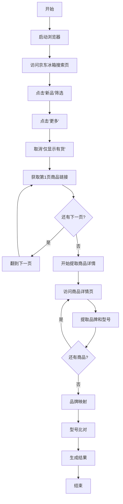

# 使用指南

## 快速开始

### 1. 访问应用

应用已自动启动，请访问以下地址：
```
http://0.0.0.0:5000
```

### 2. 准备 Excel 文件

#### Excel 文件要求

您的 Excel 文件必须包含以下 **7 个 Sheet**（顺序不限）：

| Sheet 名称 | 对应品牌 |
|------------|---------|
| Haier | 海尔 |
| Casarte | 卡萨帝 |
| Colmo | COLMO |
| Hisense&Ronshen | 海信 + 容声 |
| Midea | 美的 |
| BSH | 西门子 + 博世 |
| Meiling | 美菱 |

#### 数据格式要求

每个 Sheet 的 **第 9 行** 存储该品牌的所有型号数据。

型号必须 **横向排列**，每个单元格一个型号：

```
    A       B       C       D       E
9 | BCD-001 | BCD-002 | BCD-003 | BCD-004 | ...
```

**示例：**
```excel
Sheet: Haier
第9行: A9=BCD-450WDPEU1, B9=BCD-520WDPZU1, C9=BCD-602WGHFD2BGWU1, ...
```

### 3. 使用步骤

#### 步骤 1: 上传 Excel 文件

1. 打开应用页面
2. 点击"浏览文件"或拖拽文件到上传区域
3. 选择您准备好的 Excel 文件（.xlsx 或 .xls 格式）
4. 等待系统验证文件

**验证成功后，您会看到：**
- ✅ 绿色成功提示
- 📊 每个品牌的型号数量统计
- 📁 总型号数量

**如果验证失败，系统会提示：**
- ❌ 缺少哪些 Sheet
- ❌ 文件格式错误

#### 步骤 2: 开始爬取和比对

1. 确认 Excel 文件验证成功
2. 点击 **"🎯 开始比对"** 按钮
3. 等待爬取完成（预计 10-30 分钟）

**爬取过程中，您会看到：**
- 📝 实时进度日志
- 🔄 当前处理的页面/商品
- 📊 已处理的商品数量

**示例进度日志：**
```
正在启动浏览器...
浏览器启动成功
正在访问京东冰箱搜索页...
点击'新品'筛选...
正在爬取第 1 页...
第 1 页找到 60 个商品，累计 60 个
处理商品 1/60: https://item.jd.com/...
成功提取: 品牌=海尔（Haier）, 型号=BCD-602WGHFD2BGWU1
...
```

#### 步骤 3: 查看结果

爬取完成后，页面会自动刷新并显示结果。

**如果有缺失型号：**
- ⚠️ 显示总缺失数量
- 🔍 按品牌分组展示缺失型号
- 每个型号都有对应的京东商品链接

**如果没有缺失型号：**
- 🎉 显示成功提示

**结果示例：**
```
🔍 Haier - 15 个缺失型号

型号                    商品链接
BCD-602WGHFD2BGWU1     https://item.jd.com/10187984028937.html
BCD-520WDPZU1          https://item.jd.com/...
...
```

#### 步骤 4: 下载结果

1. 点击 **"生成 Excel 下载文件"** 按钮
2. 等待文件生成
3. 点击 **"⬇️ 下载缺失型号 Excel 文件"** 按钮
4. 保存文件到本地

**下载的 Excel 文件包含：**

1. **汇总 Sheet**：所有品牌的缺失型号汇总
   ```
   品牌    | 型号                  | 商品链接
   Haier   | BCD-602WGHFD2BGWU1   | https://...
   Casarte | BCD-520...           | https://...
   ```

2. **各品牌 Sheet**：每个品牌一个独立 Sheet
   ```
   序号 | 型号                  | 商品链接
   1    | BCD-602WGHFD2BGWU1   | https://...
   2    | BCD-520WDPZU1        | https://...
   ```

## 常见问题

### Q1: 上传 Excel 文件失败怎么办？

**A:** 请检查：
- 文件格式是否为 .xlsx 或 .xls
- 是否包含所有 7 个必需的 Sheet
- Sheet 名称是否拼写正确（区分大小写）
- 文件大小是否超过 10MB

### Q2: 爬取过程中断了怎么办？

**A:** 可能的原因：
- 网络连接不稳定 → 检查网络连接
- 京东反爬虫机制 → 稍后重试
- 浏览器崩溃 → 刷新页面重新开始

**解决方案：**
- 重新点击"开始比对"按钮
- 如果多次失败，建议等待一段时间后再试

### Q3: 为什么有些商品提取不到型号？

**A:** 可能的原因：
- 该商品没有"能效网规格型号"字段
- 型号格式不符合要求（不以 BCD- 或 MR- 开头）
- 页面加载超时

**这不影响其他商品的提取，系统会自动跳过并继续。**

### Q4: 爬取需要多长时间？

**A:** 取决于商品数量：
- 商品较少（< 500）：约 10-15 分钟
- 商品中等（500-1000）：约 15-25 分钟
- 商品较多（> 1000）：约 25-30 分钟

### Q5: 型号比对规则是什么？

**A:** 系统使用以下规则比对型号：
1. 去除所有空格和制表符
2. 转换为大写字母
3. 严格匹配

**示例：**
- `BCD-001` = `bcd-001` = `BCD- 001` = `BCD - 001`
- 只要标准化后相同，就认为是同一型号

### Q6: 如何知道某个品牌没有新品？

**A:** 查看进度日志，如果某个品牌搜索结果为空，系统会记录：
```
跳过非目标品牌: XXX
```
或
```
映射: 海尔（Haier） → Haier (0 个有效型号)
```

### Q7: Excel 第 9 行为什么是空的？

**A:** 请检查：
- 型号是否从 A9 单元格开始
- 是否在第 9 行输入了型号
- 是否有隐藏的行或列

### Q8: 可以同时比对多个 Excel 文件吗？

**A:** 不可以。每次只能上传一个文件。
如果需要比对多个文件，请：
1. 合并到一个 Excel 文件中
2. 或分别上传，分别比对

## 技术细节

### 爬取流程



### 品牌映射逻辑

系统会自动识别京东品牌并映射到对应的 Excel Sheet：

```python
京东品牌 "海尔（Haier）" → Excel Sheet "Haier"
京东品牌 "卡萨帝" → Excel Sheet "Casarte"
京东品牌 "COLMO" → Excel Sheet "Colmo"
京东品牌 "海信" 或 "容声" → Excel Sheet "Hisense&Ronshen"
京东品牌 "美的" → Excel Sheet "Midea"
京东品牌 "西门子" 或 "博世" → Excel Sheet "BSH"
京东品牌 "美菱" → Excel Sheet "Meiling"
```

### 型号验证规则

系统只比对符合以下规则的型号：
- 以 `BCD-` 开头（冰箱型号）
- 以 `MR-` 开头（部分冰箱型号）

其他格式的型号会被自动过滤。

## 注意事项

### ⚠️ 重要提醒

1. **网络要求**：需要稳定的网络连接访问京东网站
2. **运行时间**：爬取过程较长，请耐心等待，不要关闭浏览器
3. **数据准确性**：确保 Excel 文件格式正确，第 9 行数据完整
4. **反爬虫**：如果频繁使用，可能被京东反爬虫机制拦截，建议适度使用
5. **浏览器资源**：爬取过程会占用较多系统资源

### 💡 最佳实践

1. **Excel 文件准备**：
   - 提前整理好所有型号数据
   - 确保第 9 行格式正确
   - 定期备份 Excel 文件

2. **使用时机**：
   - 建议在网络状况良好时使用
   - 避免高峰时段（可能被反爬虫）
   - 每天不要频繁使用

3. **结果处理**：
   - 及时下载结果 Excel 文件
   - 定期更新本地型号库
   - 记录每次比对的日期

## 获取帮助

如果遇到问题，请：

1. 查看进度日志了解具体错误信息
2. 参考本文档的"常见问题"部分
3. 检查网络连接和 Excel 文件格式
4. 重启应用后重试

---

**祝您使用愉快！** 🎉
